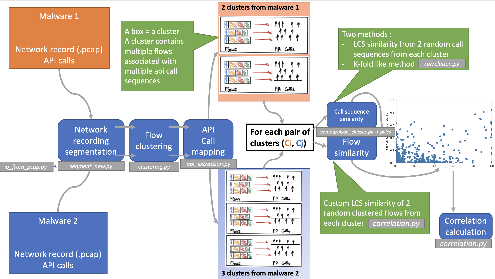

TODO: 
- Enhance segmentation (without handshake ?)
- Readme writing
- Collect benign and compare distributions
- C++ fix with new seg

# Readme: traffic analysis

The directory `exp16_visualisation` contains all the code related to the analysis of the network dataset.

## Files overview

```
.
├── trickbot1_1
├── trickbot1_2
├── trickbot1_3
├── trickbot1_4
├── trickbot1_5
├── trickbot2_1
├── trickbot2_2
├── trickbot2_3
├── benign1
├── benign2
├── pylcs
├── analysis.ipynb
├── api_embeddings.py
├── api_extraction.py
├── clustering.py
├── comparaison_classes.py
├── corpus_f.npz
├── correlation.py
├── entropy.py
├── ip_from_malware.py
├── ip_from_pcap.py
├── lcs_function.py
├── readme.md
├── sav.csv
├── segment_new.py
├── segmentation.py
├── segmentation_utils.py
├── test_emv.ipynb
├── viz1-cat.ipynb
├── w2v_weigth_2d0f9ab9.model
└── w2v_weigth_eaf801a7.model
```

The folders ``trickbot x_y`` contains the malware trace number `y` of a specific trickbot version `x`.
In the same way, the ``benign`` folders follow the same pattern. However, these benign traces were not used at first for our method.

The folder ``pylcs`` is a custom python library to allow the computation of the LCS in C++.

The rest of the python files are scripts, their usage will be explained later but to provide a quick overview:
- `correlation.py`: **top script computing the correlation score according to the method**
- `segmentation.py`: ~~depreciated script to segment the pcap into flows~~
- `segment_new.py`: script to segment the pcap into flows
- `ip_from_malware.py`: _utility script for the segment_
- `ip_from_pcap.py`: _utility script for the segment_
- `segmentation_utils.py`: _utility script for the segment_
- `clustering.py`: script to cluster the network flows
- `api_extraction.py`: script to extract the API calls for each malware
- `api_embeddings.py`: ~~script to build a word2vec embedding for the API call corpus (not used)~~
- `comparaison_classes.py`: interface for various flow comparaison functions with cache and C++ implementations
- `entropy.py`: ~~script to build a blacklist of API calls in an attempt to remove noise (not used)~~
- `lcs_function.py`: script to compute the LCS and the LCS over multiple sequences

## Method overview



## Run the script

To run the analysis, take the ``correlation.py`` script. The configuration you have to change are:
- for the main function ``correlate``, a list of relative path to malware data folders.
- in the main function ``correlate``, the parameter `old method` for the function call `inter_cluster_sim_scores_random`. True means using the LCS similarity from 2 random call sequences for each cluster; False means using the k-fold like method.
- in the beginning, 3 global variables are defined:
    - TIME_DELAY_ALLOWED represents the window tolerance to say a call sequence belong to a given flow
    - CATEGORY tells if should use the category of the API call instead of the api function name itself
    - DEBUG_CORNER allows to generate some representation for edge cases as defined in the if statements
