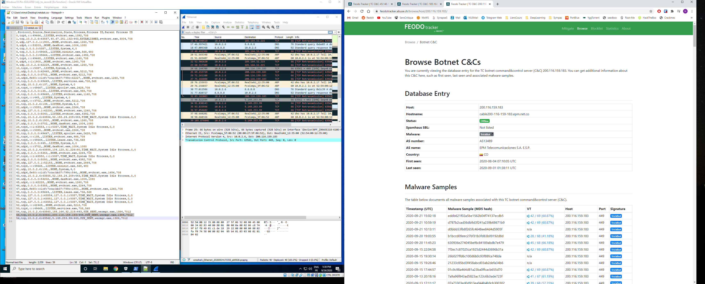

# Experiment 4

## Goals

The goal is to reiterate the previous experiment with an up-to-date Trickbot malware.  We will analyze the traffic of the malicious Trickbot and try to auto-segment it.  

## Procedure

The Trickbot is downloaded from malware-traffic-analysis : https://www.malware-traffic-analysis.net/2020/09/08/index.html.

The guest is a Windows 10 VM.

Steps :

- Launch Wireshark to record network packets
- Launch `netstat.py` to map network activities with processes
- Launch the malware

## Analysis

At first glance, the malware tried to contact inactive C2 servers. At some points, it reached an active one.

The k-means technique of experiment 2 does not work. It doesn't take into account two factors :

- different server IP addresses are in different groups
- inside a same semantic action (pinging c&c), multiple general actions can have delays between them (>> actual internet delay)

## Conclusion of the experiment

