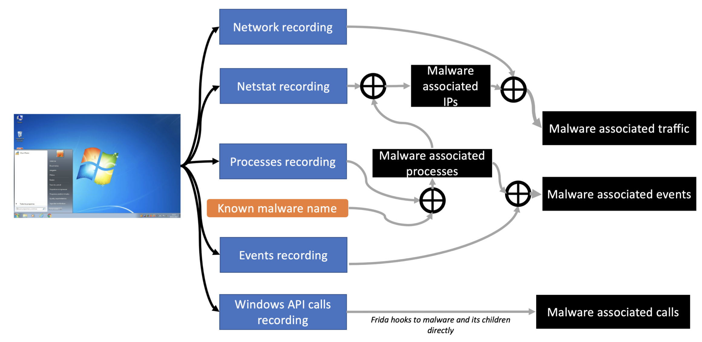
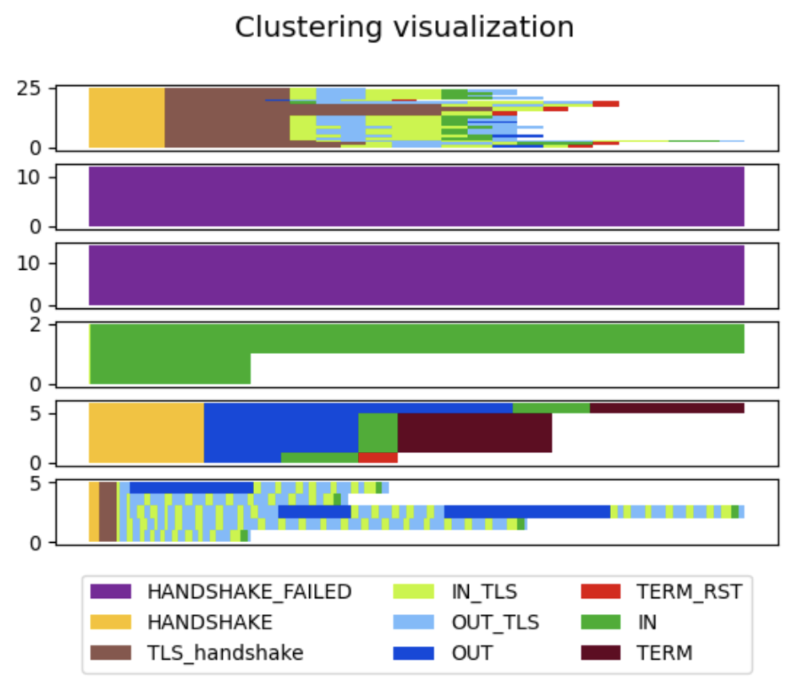

# malware-traffic

A malware traffic analysis platform to detect and explain network traffic anomaly

## Setup

The scripts are written in Python. The first step is to install the requirements with pip:
```pip install -r requirements.txt```.

We also wrote a C++ library (modified an already existed one to be precise) to speed up some custom function computations. The consequence is that you need to install it manually.
The library is in `Experiments/exp16_visualisation/pylcs` or at https://github.com/nima3333/pylcs.
You can just install by typing: ``python3 setup.py install``.

## Use

The repository contains all the code in the `Experiments` directory. Each experiment is a step we took to develop the project.
Curently, only [exp15_frida_apis](Experiments/exp15_frida_apis/readme.md) and [exp16_visualisation](Experiments/exp16_visualisation/readme.md) are used. The first one is the set of scripts needed to record the malware activity on our virtual machine in order to build our dataset.
The second one is the set of scripts used to analyze the dataset. 
You can find more relevent readme in both previously mentioned directories.

## Tutorial

### How to get the traffic ?
Getting the traffic for a given malware could be seen as an easy task: just record it with wireshark.
However, for our tool, we need to only record malware traffic, therefore we need to discriminate the malware traffic from the other softwares/OS traffic (especially true with Windows 10).
To do so, we also record the mapping between open ports and PID with the process list including PID. This also allows us to keep tracking malware children.



We built tools to do this recording on a Windows virtual machine. This [link](Experiments/exp15_frida_apis/readme.md) shows the readme of this process.

### How to get its visualization ?

We built a tool in Python to visualize the traffic recorded and segmented. To do so, we need the directory generated by the previous step.
Simply go in `exp16_visualisation` and get the `segment_new.py` script.

The script contains the following section at the end of the file:
```
if __name__ == "__main__":
	flows, ip2flow = get_seg("./benign2/")
	visualize_segmentation(flows, ip2flow)
```
Just replace the `./benign2/` with the path to the previously mentioned directory containing the recordings of the malware.

The result of a run should yield a result like this:


### How to visualize its clustering ?

Once we have visualized the segmented traffic, we can cluster the flows and visualize this clustering.
Simply go in `exp16_visualisation` and get the `clustering.py` script.

The script contains the following section at the end of the file:
```
if __name__ == "__main__":
	segmentations, _ = get_seg(path="./benign2/")
	cluster_indexes, nb_class = cluster_segmented_flow(segmentations, None, method="spectral")
	# evaluate_clustering(segmentations)
	visualize_clustering(cluster_indexes, segmentations)
	CachedCustomLCS().print_stat()
```
Just replace the `./benign2/` with the path to the previously mentioned directory containing the recordings of the malware.

The result of a run should yield a result like this:



### How to run the analysis ?

The instructions can be found in [exp16 readme](Experiments/exp16_visualisation/readme.md) in the ``Run the script`` section.
